# EMQX INSTALLATION AND CONFIGURATION

<div class="grid cards" markdown>

-   :material-file:{ .lg .middle } __EMQX ON UBUNTU🎯__

    ---

    [:octicons-arrow-right-24: <a href="https://www.emqx.com/zh/blog/how-to-install-emqx-mqtt-broker-on-ubuntu" target="_blank"> Portal </a>](#)

</div>

## 1. INSTALL EMQX

### 1.1 CONNECT TO THE SERVER

```bash
ssh <username>@<server-ip>
```

Replace `<username>` with the username of the server and `<server-ip>` with the IP address of the server.

### 1.2 CONFIGURE THE EMQX APT REPOSITORY

```bash
curl -s https://assets.emqx.com/scripts/install-emqx-deb.sh | sudo bash
```

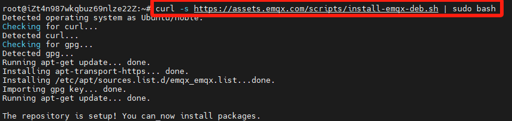

### 1.3 DOWNLOAD EMQX

```bash
sudo apt-get install emqx
```

### 1.4 START EMQX

```bash
sudo emqx start
```

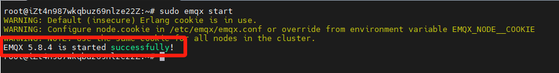

### 1.5 ACCESS THE EMQX CONSOLE

EMQX provides a command-line tool that allows users to easily start, stop, and access the EMQX console. As shown in the image below, execute `sudo emqx` in the terminal to view the available EMQX management commands.

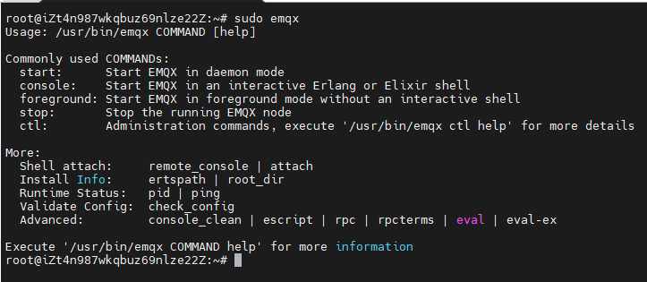

## 2. EMQX OPERATION CHECK

### 2.1 PORT LISTENING STATUS

Use the command `netstat -tunlp` to check the running status of EMQX ports. By default, EMQX starts the following ports. If there are any exceptions, check the port occupancy status.

> The command is also available before installing EMQX to ensure that the relevant ports are not in use.

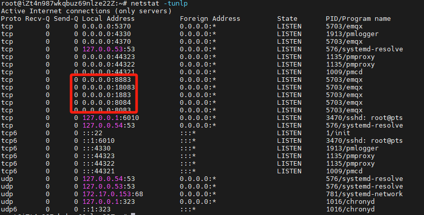

| Port | Description |
| --- | --- |
| 1883 | MQTT/TCP protocol port |
| 8883 | MQTT/TLS protocol port |
| 8083 | MQTT/WS protocol port |
| 8084 | MQTT/WSS protocol port |
| 18083 | Dashboard port |
| 4370 | Erlang distribution port |
| 5370 | Cluster RPC port |

### 2.2 VISIT DASHBOARD

EMQX provides a web-based dashboard that allows users to monitor and manage the MQTT broker. To access the dashboard, open a web browser and enter the URL `http://<server-ip>:18083`. Replace `<server-ip>` with the IP address of the server.

> Before accessing the dashboard, ensure that the server's firewall has opened port 18083.

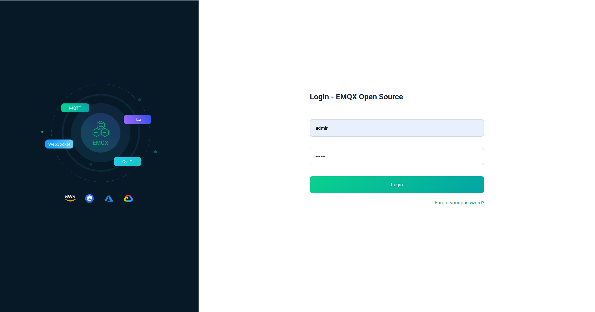

The default username and password for the EMQX dashboard are `admin` and `public`, respectively. The first time you log in successfully, you will be prompted to change the password. 

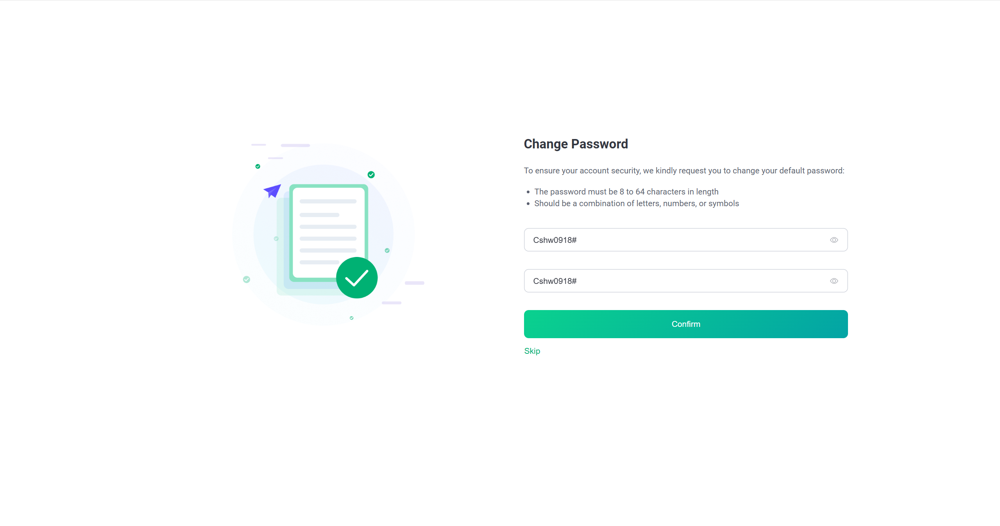

After changing the password, you can also change the language of the dashboard to Simplified Chinese on the Settings page.

## 3. MQTT CONNECTION TEST

Next, click on the "WebSocket Client" in the left menu. This client can be used to test MQTT over WebSocket and verify whether the MQTT server has been successfully deployed.

> Ensure that the firewall is configured to allow access on port 8083.

### 3.1 Connecting to the MQTT Server

As shown in the image below, the tool automatically fills in the hostname based on the access address. Simply click the "Connect" button.

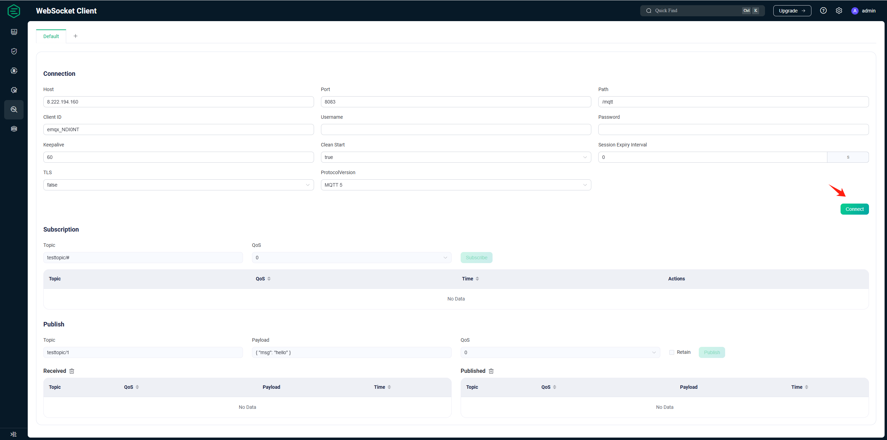

The following image indicates a successful connection.

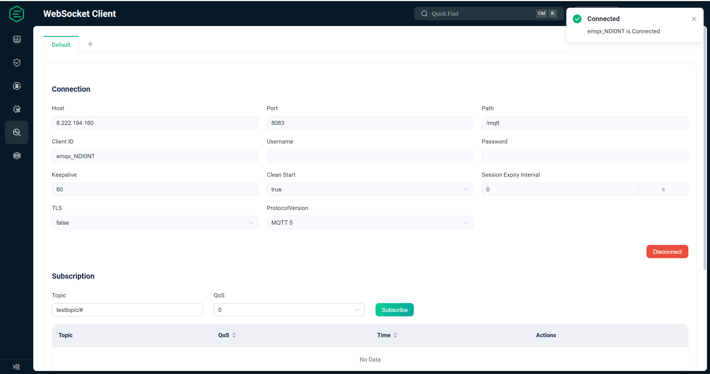

### 3.2 Subscribing to a Topic

As shown in the image below, subscribe to a topic called `testtopic`.

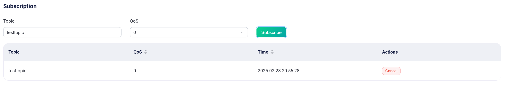

### 3.3 Publishing Messages

As shown in the image below, we published two messages to `testtopic` and received them successfully, which indicates that the MQTT server has been deployed correctly and is functioning normally.

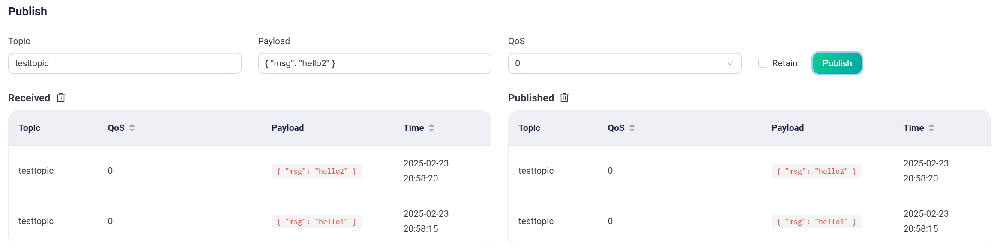

At this point, we have completed the setup and connection testing of the MQTT server. However, note that this server is only for testing purposes. To deploy an MQTT server suitable for a production environment, the most critical step—authentication configuration—still needs to be completed.

## 4. Configuration of Authentication (Optional, Typically Required for Production; Can Be Skipped for Testing)

By default, EMQX allows any client to connect until the user creates an authenticator. The authenticator verifies the client’s identity based on the provided credentials, and only authenticated clients can successfully connect. Next, we will demonstrate how to use EMQX's built-in database for username and password authentication.

> EMQX also supports integration with various backend databases for authentication, including MySQL, PostgreSQL, MongoDB, and Redis. For more authentication methods, please refer to the documentation: https://docs.emqx.com/zh/emqx/v5.0/security/authn/authn.html

### 4.1 Creating Authentication

Starting from version 5.0, EMQX supports configuring authentication through the Dashboard, making it easier and faster to set up a secure MQTT service. Click on the "Authentication" option under the "Access Control" menu, and then click the "Create" button on the far right.

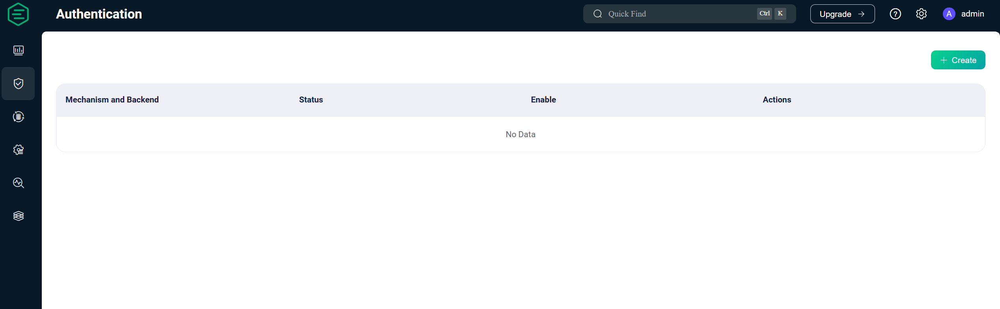

Select the **Password-Based** option and then click **Next**.

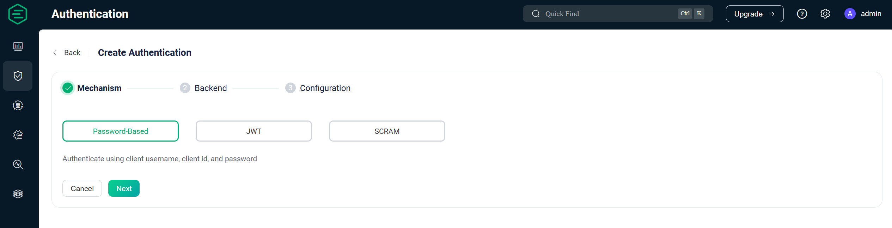

For the database, choose **Built-in Database** and click **Next**.

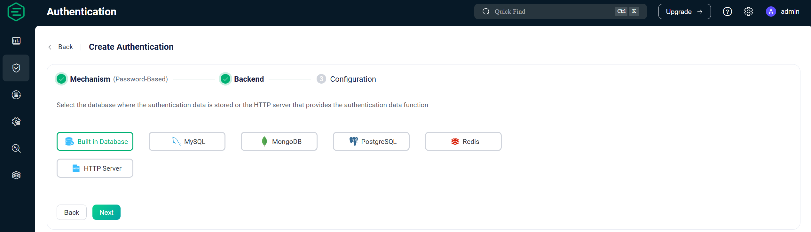

Next, select the account type, encryption method, and salting method, and then click **Create**.

> Here we use the default configuration. Users can choose options based on their actual business requirements.

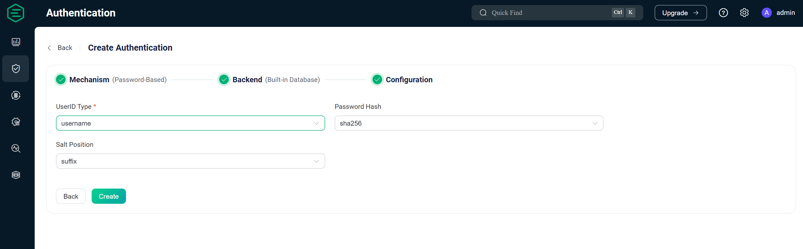

### 4.2 Adding a User

After the authenticator is successfully created, as shown in the image below, click on **User Management** to add a user.


In the User Management page, click the **Add** button on the far right. In the popup window, set the username and password, and then click **Save**.

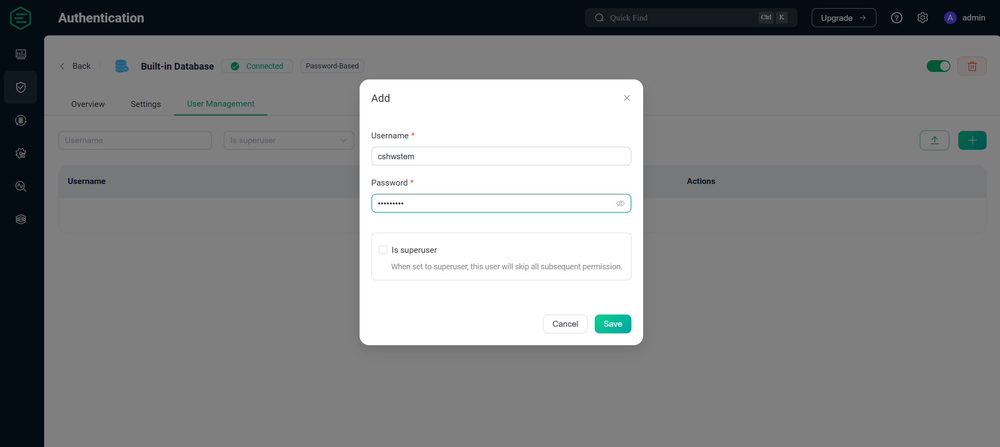

The image below indicates that the user was created successfully.

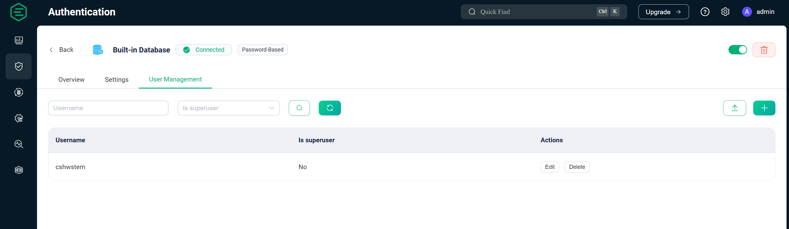

### 4.3 Testing Authentication

Next, use the WebSocket tool provided in the Dashboard to test whether authentication has been configured correctly. In the connection settings, enter the username and password that you just created, and then click **Connect**.

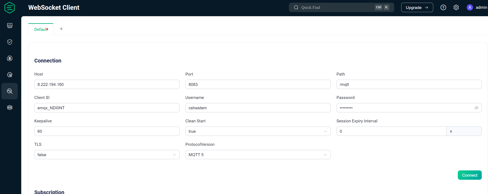

You will see a popup on the right indicating that the connection is successful.

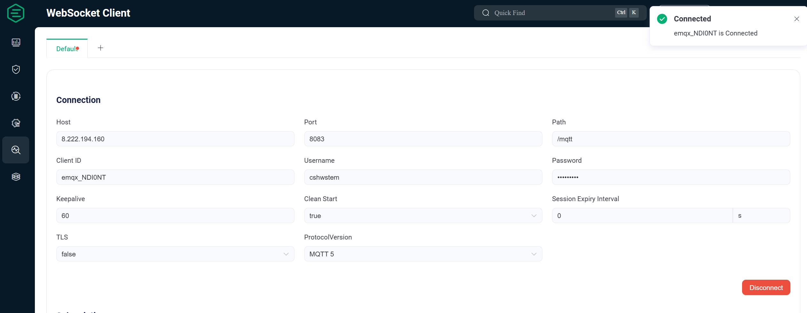

Then, try using an unregistered username (e.g., `test1`). When you click **Connect**, you will see connection failure information as shown below.

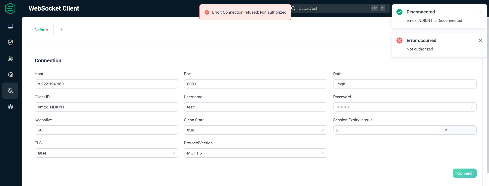

At this point, we have completed the authentication configuration for EMQX and set up a single-node MQTT server suitable for production. To ensure high availability of the MQTT server, you would need to create an EMQX cluster with multiple nodes. The details of setting up a cluster are not covered in this article; please refer to the EMQX clustering documentation for further configuration details.
