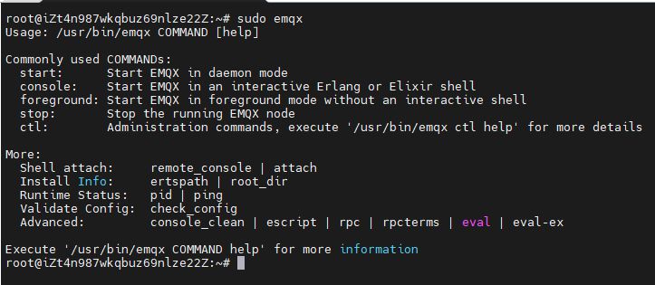
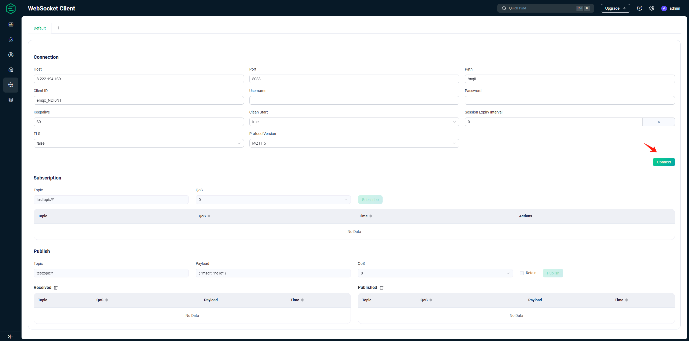
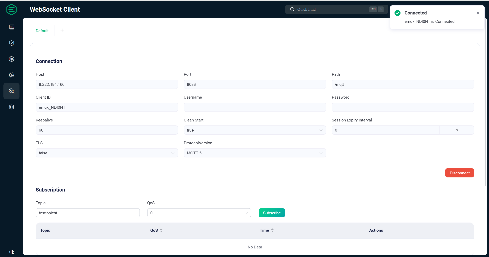
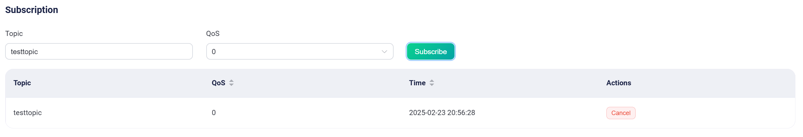
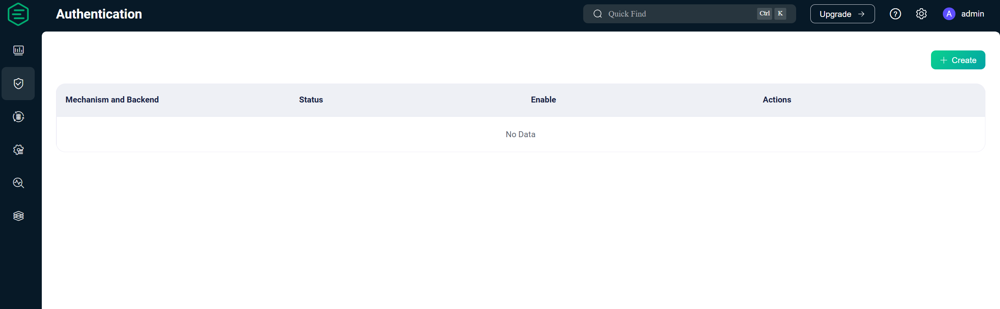
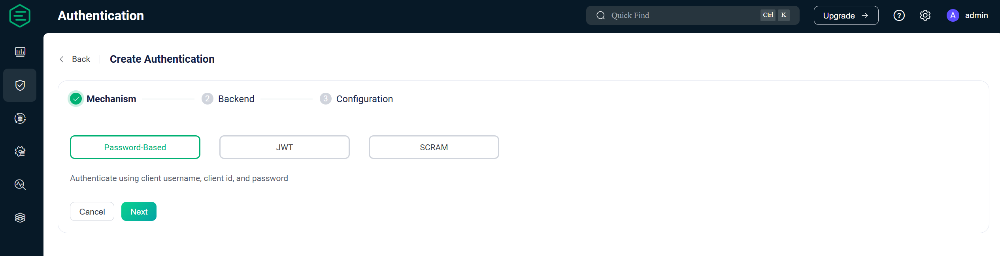
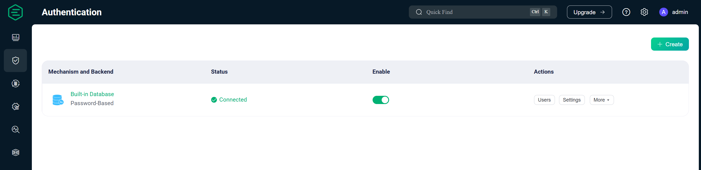

# EMQX 安装与配置

<div class="grid cards" markdown>

-   :material-file:{ .lg .middle } __EMQX ON UBUNTU🎯__

    ---

    [:octicons-arrow-right-24: <a href="https://www.emqx.com/zh/blog/how-to-install-emqx-mqtt-broker-on-ubuntu" target="_blank"> Portal </a>](#)

</div>

## 1. 安装 EMQX

### 1.1 连接到服务器

```bash
ssh <username>@<server-ip>
```

将`<username>`替换为服务器的用户名，`<server-ip>`替换为服务器的 IP 地址。

### 1.2 配置 EMQX APT 仓库

```bash
curl -s https://assets.emqx.com/scripts/install-emqx-deb.sh | sudo bash
```


### 1.3 下载 EMQX

```bash
sudo apt-get install emqx
```

### 1.4 启动 EMQX

```bash
sudo emqx start
```


### 1.5 访问 EMQX 控制台

EMQX 提供了一个命令行工具，允许用户轻松启动、停止和访问 EMQX 控制台。如下图所示，在终端中执行 `sudo emqx` 即可查看可用的 EMQX 管理命令。



## 2. EMQX 运行情况检查

### 2.1 端口监听情况

使用命令 `netstat -tunlp` 检查 EMQX 端口运行情况，默认情况下 EMQX 会启动如下端口，若有异常请检查端口占用情况。

>该命令也可在 EMQX 安装前执行，确保相关端口未被占用。


| 端口 | 描述 |
| --- | --- |
| 1883 | MQTT/TCP 协议端口 |
| 8883 | MQTT/TLS 协议端口 |
| 8083 | MQTT/WS 协议端口 |
| 8084 | MQTT/WSS 协议端口 |
| 18083 | Dashboard 端口 |
| 4370 | Erlang 分布式传输端口 |
| 5370 | 集群 RPC 端口，默认情况下，每个 EMQX 节点有一个 RPC 监听端口。|

### 2.2 访问Dashboard

EMQX 提供了 Dashboard，以方便用户通过 Web 页面管理、监控 EMQX 并配置所需的功能。EMQX 成功启动之后可以通过浏览器打开 http://localhost:18083/（将 localhost 替换为实际 IP 地址）访问 Dashboard。

>访问 Dashboard 之前需要确保服务器的防火墙打开了 18083 端口。


Dashboard 的默认用户名为 `admin`，密码为 `public`，第一次登录成功后会提示修改密码。密码修改完成后，我们也可以在 Settings 页面将 Dahshboard 的语言改为 简体中文。


## 3. MQTT 连接测试

接下来我们点击左侧菜单栏里面的 WebSocket 客户端 ，该客户端可测试 MQTT over Websocket，验证 MQTT 服务器是否已部署成功。

>需要确保防火墙已打开 8083 端口访问权限。

### 3.1 连接至MQTT服务器

如下图，该工具已根据访问地址自动填充了主机名，我们直接点击`连接`按钮。

 

如下图，提示连接成功。



### 3.2 订阅主题

如下图，订阅一个 `testtopic` 主题。



### 3.3 发布消息

如下图，我们向 `testtopic` 发布了两条消息，且接收成功，表明 MQTT 服务器已部署成功且在正常运行。


至此，我们已完成了 MQTT 服务器的搭建及连接测试，但是该服务器仅仅只能用于测试，若要部署生产环境下可用的 MQTT 服务器，我们还需要进行最重要的认证配置。

## 4. 配置认证 (可选，生产阶段一般需要，测试阶段可跳过)

默认情况下，EMQX 将允许任何客户端连接，直到用户创建了认证器。认证器将根据客户端提供的认证信息对其进行身份验证，只有认证通过，客户端才能成功连接。接下来我们将演示如何使用 EMQX 内置的数据库进行用户名、密码认证。

>EMQX 也提供了与多种后端数据库的认证集成支持，包括 MySQL、PostgreSQL、MongoDB 和 Redis。查看文档了解更多认证方式：https://docs.emqx.com/zh/emqx/v5.0/security/authn/authn.html
 
### 4.1 创建认证

EMQX 从 5.0 开始支持在 Dashbaord 配置认证，以方便用户能更加方便、快速的创建安全的 MQTT 服务。我们点击 访问控制 菜单下的 认证 进入认证配置页面，然后点击最右侧的 创建 按钮。



选择 Password-Based 选项，然后点击 下一步。



数据库选择 Built-in Database，然后点击 下一步。


接下来选择账户类型、加密方式、加盐方式，并点击 创建。

>这里我们使用默认配置，读者可根据业务实际需求进行选择。


### 4.2 添加用户

认证创建成功后如下图。接下来我们点击 用户管理添加用户。



进入用户管理页面后，我们点击最右侧的 添加 按钮，并在弹出框里设置用户名与密码，之后点击 保存。


如下图表示创建成功。


### 4.3 测试认证

接下来我们使用 Dashboard 提供的 Websocket 工具来测试认证是否已配置成功。在连接配置里输入刚才创建的用户名与密码，然后点击连接。


将会看到右侧弹窗提示已连接。


接下来我们使用一个未创建的用户名 test1，点击连接将会看到如下连接失败信息。


至此，我们已完成了 EMQX 的认证配置，搭建了一台可用于生产环境的单节点 MQTT 服务器。若要保证 MQTT 服务器的高可用，还需要创建多个节点的 EMQX 集群，创建集群的具体细节本文不再详述，读者可参考 EMQX 集群文档 进行配置。