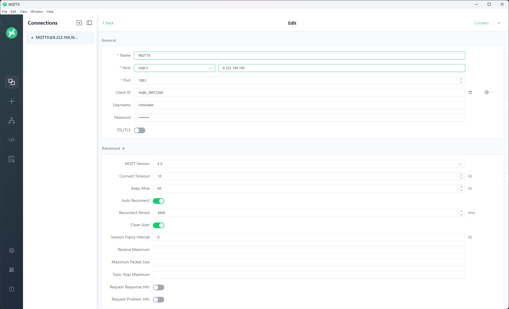
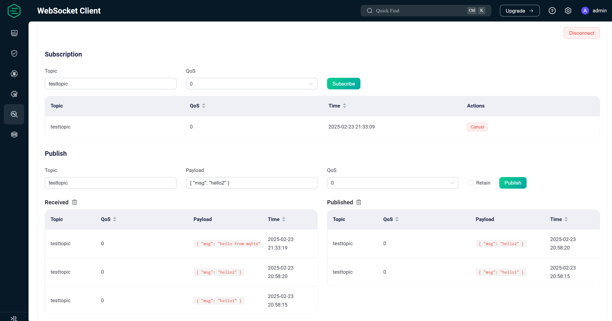

# MQTTX 

!!! INFO "MQTTX"
    MQTTX is a cross-platform MQTT 5.0 client tool that supports Windows, macOS, and Linux. It is an open-source project developed based on [Electron](https://electronjs.org/). Its most common use is to test MQTT servers to ensure that they are running properly.

## QUICK START

We will use the test in the previous EMQX example as an example. This time, we will use MQTTX as the publisher and the WebSocket client as the subscriber.

As shown in the figure above, fill in the relevant information and click Connect.

In the MQTTX operation interface, fill in the topic and message content, click Publish, and you can see the history of published messages in the figure.

In the WebSocket client, reconnect, and you can see the message you just received in the lower-left corner.

