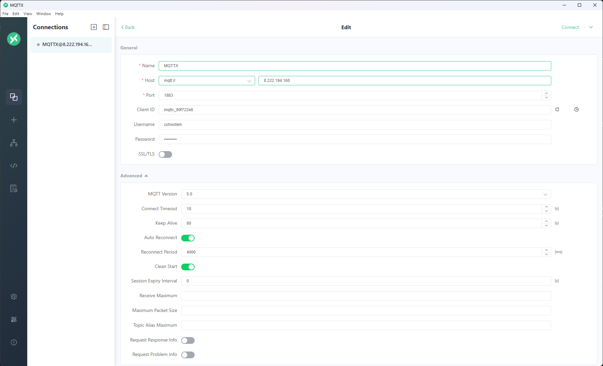
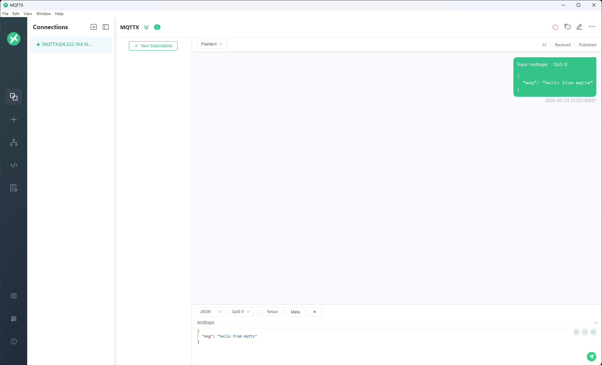
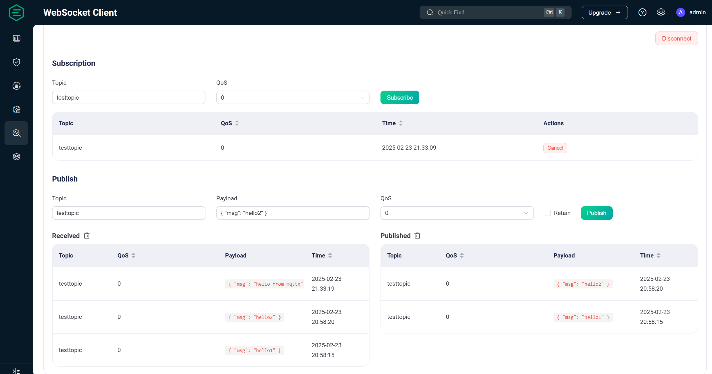

# MQTTX 软件

!!! INFO "MQTTX"
    MQTTX 是一个跨平台的 MQTT 5.0 客户端工具，支持 Windows、macOS 和 Linux。它是一个开源项目，基于 [Electron](https://electronjs.org/) 开发。其最常见的用途是测试 MQTT 服务器，以确保服务器正常运行。

## 快速上手

我们以前文EMQX为例中的测试为例，这次我们使用MQTTX作为发布者，上次的Websocket客户端作为订阅者。

如上图所示，填入相关信息后，点击连接。

在MQTTX操作界面中，填入主题，和消息内容，点击发布，图中可以看到发布的历史消息。

在Websocket客户端中，恢复连接，可以在左下角看到刚刚收到的消息。